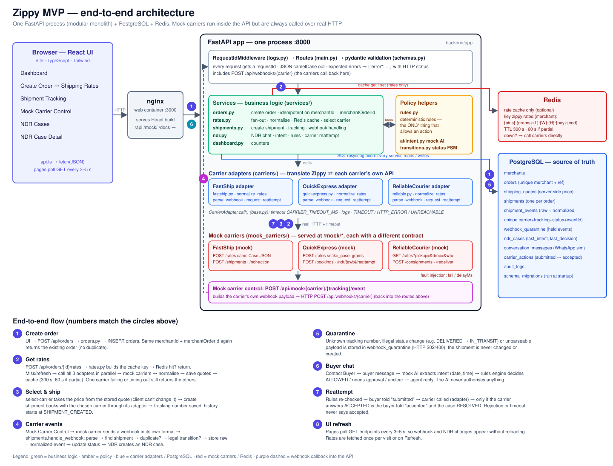

# Zippy – logistics integration + NDR agent (MVP)

## 1. Project overview
Zippy aggregates shipping rates from three carriers that each expose a **different API contract**
(FastShip, QuickExpress, ReliableCourier), normalises them into one shape, caches them in Redis, lets a merchant select a
carrier and create a shipment, ingests carrier **webhooks** (idempotent, auditable, status-validated), and runs an
**NDR (non-delivery report) agent** flow: simulated WhatsApp → mock intent extraction → deterministic rules → carrier
reattempt → buyer confirmation (never before the carrier accepts).

Guides: [`docs/CODEBASE_GUIDE.md`](docs/CODEBASE_GUIDE.md) (every file and flow explained) and
[`docs/UI_FLOW_GUIDE.md`](docs/UI_FLOW_GUIDE.md) (every screen/button → API → function). Design choices, strategies and limits are documented in [`docs/assumptions.md`](docs/assumptions.md);
the acceptance checklist with the test that proves each item is in [`docs/acceptance-checklist.md`](docs/acceptance-checklist.md).

## 2. Architecture


*Full-size diagram: [`docs/architecture.svg`](docs/architecture.svg) / [`docs/architecture.png`](docs/architecture.png). Text version:*

```
React (Vite · TS · Tailwind)  ──►  FastAPI modular monolith  ──►  PostgreSQL (state, audit, quarantine)
   served by nginx :3000            │                              Redis (rate cache only; optional at runtime)
                                    ├─ services/   orders · rates · shipments(+webhooks, tracking) · ndr · dashboard
                                    ├─ carriers/   CarrierAdapter + FastShip / QuickExpress / ReliableCourier adapters
                                    ├─ mock_carriers/  three mock carrier APIs + webhook sender (served at /mock/*, reached over HTTP)
                                    ├─ transitions.py shipment status state machine
                                    ├─ ai/intent.py   IntentExtractor interface + MockIntentExtractor
                                    └─ rules.py       deterministic policy (AI never authorises)
```
Carrier-specific shapes never leave `app/carriers/*`; everything else (and the frontend) only sees `NormalizedRate` / normalised webhook events.

## 3. Prerequisites
- **Docker path:** Docker with the Compose plugin.
- **Local path:** Python 3.11+, Node 20+, PostgreSQL 14+, Redis 6+.

## 4. Environment variables
Copy `.env.example`; all are read from the environment (nothing is hardcoded). Docker Compose sets them for you.

| Variable | Default | Purpose |
|---|---|---|
| `DATABASE_URL` | `postgresql://postgres@localhost:5432/zippy` | Postgres connection |
| `REDIS_URL` | `redis://localhost:6379/0` | Redis connection |
| `CARRIER_BASE_URL` | `http://127.0.0.1:8000` | Base for the default per-carrier URLs |
| `FASTSHIP_BASE_URL` / `QUICKEXPRESS_BASE_URL` / `RELIABLE_BASE_URL` | `$CARRIER_BASE_URL/mock/<carrier>` | Carrier API roots |
| `WEBHOOK_BASE_URL` | `$CARRIER_BASE_URL` | Where mock carriers POST webhooks |
| `CARRIER_TIMEOUT_MS` | `3000` | Timeout for every carrier request |
| `RATE_CACHE_TTL` | `300` | Seconds to cache a complete rate result |
| `PARTIAL_RATE_CACHE_TTL` | `60` | Seconds to cache a partial rate result |
| `DEFAULT_MERCHANT_ID` | `MER-DEMO` | Merchant used when the request omits `merchantId` |
| `SEED_DEMO` | `true` | Seed demo merchant/order/shipment on first start |
| `MAX_AUTO_RESCHEDULE_DAYS` | `2` | NDR rules: auto-approve reschedules within N days |
| `LOG_LEVEL` | `INFO` | Structured log level |

## 5. Docker setup (recommended)
```
docker compose up --build
```
Starts `postgres`, `redis`, `api` (migrations + seed run on boot) and `web`.
- UI: http://localhost:3000  ·  API: http://localhost:8000  ·  **Swagger UI: http://localhost:8000/docs**  ·  OpenAPI JSON: http://localhost:8000/openapi.json
- Reset all data: `docker compose down -v`.

## 6. Local setup (without Docker)
**Database & Redis**
```
createdb zippy                      # or: psql -c "create database zippy"
redis-server --daemonize yes        # or any Redis on REDIS_URL
```
**Migrations** run automatically when the API starts (ordered `backend/app/migrations/*.sql`, tracked in `schema_migrations`).
To run them without serving: `cd backend && python -c "from app import db; db.init_pool(); db.migrate()"`.

**Seed** (demo merchant `MER-DEMO`, order `ZPY-ORD-10001` for Rahul Sharma, FastShip shipment `FST123456789`) runs on start when
`SEED_DEMO=true` and the orders table is empty. Manual: `cd backend && python -c "from app import db, seed; db.init_pool(); db.migrate(); seed.seed()"`.

**API**
```
cd backend && pip install -r requirements.txt
export DATABASE_URL=postgresql://postgres@localhost:5432/zippy REDIS_URL=redis://localhost:6379/0
uvicorn app.main:app --port 8000
```
**Frontend**: `cd frontend && npm install && npm run dev` (http://localhost:5173, proxies `/api` and `/mock/` to :8000).

## 7. API documentation
Interactive docs are generated from the code: **`/docs`** (Swagger UI, vendored so it works offline) and **`/openapi.json`**. Every endpoint documents request
bodies, response bodies, error responses and examples. Summary (all JSON is camelCase; every response has an `X-Request-ID` header):

| Method | Path | Notes |
|---|---|---|
| POST | `/api/orders` | Idempotent on `merchantId + merchantOrderId`: 201 new, 200 + `duplicate:true` replay, 409 if same key but different details |
| GET | `/api/orders`, `/api/orders/{id}` | |
| POST/GET | `/api/orders/{id}/rates[?refresh=true]` | Normalised rates, `errors[]` for failed/timed-out carriers, `partial`, `cached`, `cacheStatus`, `cacheKey` |
| POST | `/api/orders/{id}/select-carrier` | Price comes from the stored quote; a differing client `price` → 409 |
| POST | `/api/orders/{id}/shipment` | |
| GET | `/api/orders/{id}/tracking[?includeRaw=true]` | `currentStatus` + `statusHistory[]` (+ raw/normalized per event) |
| POST | `/api/webhooks/{fastship\|quickexpress\|reliable}` | 200 processed/duplicate · 202 quarantined · 400 unparseable |
| GET | `/api/webhook-quarantine` | Investigation log |
| GET | `/api/ndr`, `/api/ndr/{id}` | |
| POST | `/api/ndr/{id}/contact`, `/message`, `/reattempt` | Simulated WhatsApp, intent + rules, carrier action |
| GET | `/api/shipments`, `/api/dashboard`, `/api/health` | |
| POST | `/api/mock/{carrier}/{tracking}/event` | Mock carrier control (emits a real webhook) |
| POST/GET | `/mock/_control/failures` | Fault injection |

Example:
```
curl -s -XPOST localhost:8000/api/orders -H 'content-type: application/json' -d '{
  "merchantId":"MRC-100","merchantOrderId":"SHOP-5001","customerName":"Rahul Sharma","phone":"9876543210",
  "pickupPincode":"560001","deliveryPincode":"110001","weightGrams":1500,"lengthCm":20,"widthCm":15,"heightCm":10,
  "paymentMode":"COD","codAmount":2500}'
curl -s -XPOST localhost:8000/api/orders/ZPY-ORD-10002/rates     # cacheKey: zippy:rates:MRC-100:560001:110001:1500:20:15:10:COD:2500
```

## 8. Mock carrier instructions
The three mock carriers live in `backend/app/mock_carriers/router.py` and are served by the API at `/mock/<carrier>/…`.
They are intentionally different:

| | FastShip | QuickExpress | ReliableCourier |
|---|---|---|---|
| Rates | `POST /mock/fastship/rates` JSON camelCase (`weightGrams`, `dimensions{lengthCm…}`) → `{service, price, etaDays}` | `POST /mock/quickexpress/rates` snake_case (`from_pin`, `weight_grams`, `dimensions_cm{l,w,h}`) → `{product, payable, deliveryEstimate}` | `GET /mock/reliable/rates?pickup&drop&wt&l&b&h` → `{options:[{code, amount, days}]}` |
| Create | `POST /shipments` → `{shipmentId, awb}` | `POST /bookings` → `{booking:{id,tracking}}` | `POST /consignments` → `{consignmentNo, trackingRef}` |
| Reattempt | `POST /ndr-action` → `{status:"ACCEPTED"}` | `POST /ndr/{awb}/reattempt` → `{result:"OK"}` | `POST /consignments/{ref}/redeliver` → `{accepted:true}` |
| Webhook | `{trackingNumber, status:"OFD", eventId, reasonCode}` | `{awb, id, event:{code, reason}}` | `{reference, seq, state:"Out For Delivery", undeliveredCode}` |

**Fault injection** (to demo partial results / timeouts):
```
curl -XPOST localhost:8000/mock/_control/failures -H 'content-type: application/json' -d '{"carrier":"quickexpress","fail":true}'
curl -XPOST localhost:8000/mock/_control/failures -H 'content-type: application/json' -d '{"carrier":"reliable","delayMs":5000}'   # > CARRIER_TIMEOUT_MS => TIMEOUT
curl -XPOST localhost:8000/mock/_control/failures -H 'content-type: application/json' -d '{"carrier":"reliable","delayMs":0}'
```
Carrier slugs: `fastship`, `quickexpress`, `reliable`.

## 9. Webhook instructions
Carriers POST to `/api/webhooks/{slug}`. You don't need to craft payloads: the **Mock Carrier Control** page (or
`POST /api/mock/{slug}/{trackingNumber}/event {"status":"PICKED_UP","eventId":"optional"}`) makes the mock carrier send a
real webhook in its own format to Zippy. Behaviour:
- Idempotent on `carrier + trackingNumber + status + eventId` (resend the same `eventId` to see `duplicate`).
- Raw payload **and** normalised event are stored (`GET /api/orders/{id}/tracking?includeRaw=true`).
- Unknown tracking numbers and invalid status transitions are **quarantined** (HTTP 202), never applied; see
  `GET /api/webhook-quarantine` or the table on the Mock Carrier Control page.
- Allowed transitions: see [`docs/assumptions.md`](docs/assumptions.md#status-transition-strategy).

## 10. Testing
```
cd backend && python -m pytest -q            # needs Postgres + Redis reachable
docker compose exec api python -m pytest -q  # inside the stack (use -e TEST_DATABASE_URL / TEST_REDIS_URL, see below)
```
The suite creates/drops its own `zippy_test` database and uses Redis db 15 (`TEST_DATABASE_URL`, `TEST_REDIS_URL` override).
It starts a real uvicorn server so adapters → mock carriers → webhooks run over actual HTTP. Covered: order idempotency (incl.
concurrent), three carrier contracts + normalisation, cache miss/hit/expiry/refresh, per-field cache-key changes, partial results + TTL,
carrier timeout, Redis outage fallback, selection + immutable quote, shipment creation, webhook idempotency (incl. concurrent), raw+normalized
storage, unknown tracking, status regression, NDR/intent/rules/reattempt, structured logs, OpenAPI, and a full E2E test.

## 11. Demo flow (3–5 min)
1. **Create Order** (prefilled). Submit twice → second time shows the *duplicate protection* notice and no new order.
2. Rates page: three carriers side by side; **sort** by price / delivery time / carrier; note the cache label + key. Reload → *Served from Redis cache*; **Refresh rates** → live.
3. **Select Carrier** (FastShip) → **Create Shipment**.
4. **Mock Carrier Control**: Pickup → In Transit → Out For Delivery → Trigger NDR. Try **Delivered** then **Pickup** to see an invalid regression land in the quarantine table; **Resend last webhook** to see duplicate handling.
5. **NDR Cases** → open case → **Contact Buyer** → send `Yes tomorrow evening after 6` → intent `RESCHEDULE_DELIVERY`, rules `ALLOWED` → **Request Reattempt** → buyer sees "submitted", then "The carrier has accepted the reattempt request."
6. Mock Carrier Control → **Delivered**; **Shipment Tracking** shows the full history (expand raw/normalized per event).
7. API docs at `/docs`; structured logs via `docker compose logs api`.

## Known limitations
See [`docs/assumptions.md`](docs/assumptions.md) (no auth, webhook signatures, approvals workflow, real LLM/WhatsApp, etc.).
