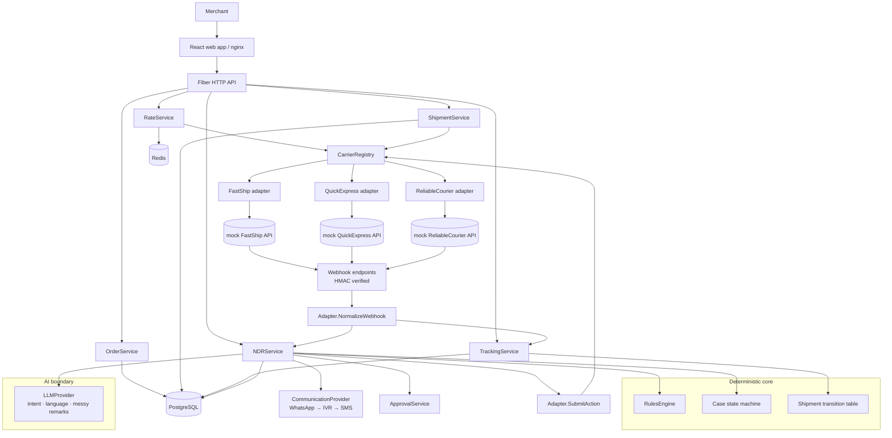
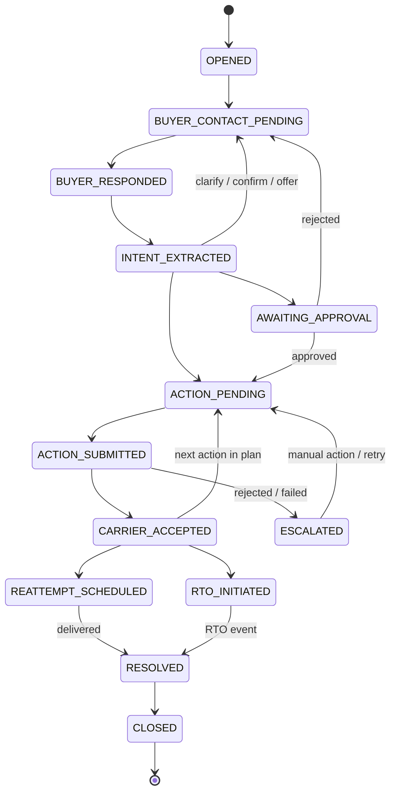

# Architecture

Zippyy is a **modular monolith** (one Go API process) with isolated mock carrier integrations, PostgreSQL as the
source of truth and Redis as a rate cache. Boundaries are enforced by Go packages so each module can later be split
into a service without redesign.

## System architecture



## Package map

| Package | Responsibility | May import |
|---|---|---|
| `domain` | Types, validation, shipment transition table, case state machine, money | stdlib only |
| `carriers` | `Adapter` interface, registry, FastShip/QuickExpress/ReliableCourier adapters (only place carrier formats exist) | `domain` |
| `rates` | Concurrent fan-out, Redis cache, single-flight | `carriers`, `domain` |
| `rules` | **Deterministic** NDR decision engine (pure functions) | `domain` |
| `agent` | **AI boundary**: `LLMProvider`, mock provider, language detection, localized templates | `domain` |
| `comms` | `Provider` interface + mock WhatsApp/IVR/SMS, priority dispatcher | — |
| `store` | PostgreSQL repositories, migrations runner | `domain` |
| `service` | Orders, rates persistence, selection, shipments, tracking, webhook pipeline | all of the above |
| `ndr` | NDR orchestration: cases, contact, reply, approvals, execution, timeouts | `rules`, `agent`, `comms`, `carriers`, `store` |
| `httpapi` | Fiber routing, middleware, JSON mapping (no business logic) | `service`, `ndr` |
| `app` | Wiring + demo seed | everything |

`rules` and `domain` never import `agent` — the compiler enforces that the LLM cannot influence deterministic decisions.

## Order / rate sequence

```mermaid
sequenceDiagram
  participant UI
  participant API
  participant Agg as Rate aggregator
  participant R as Redis
  participant C1 as FastShip
  participant C2 as QuickExpress
  participant C3 as ReliableCourier
  participant DB as PostgreSQL
  UI->>API: POST /api/orders
  API->>DB: insert order (unique merchant+merchantOrderId)
  UI->>API: POST /api/orders/{id}/rates
  API->>Agg: GetRates(order, refresh)
  Agg->>R: GET zippy:rates:…
  alt cache hit
    R-->>Agg: normalized result
  else miss (single-flight: one fan-out for N identical callers)
    par concurrent, per-carrier timeout
      Agg->>C1: POST /fastship/api/v1/rate
      Agg->>C2: POST /quickexpress/rates/check
      Agg->>C3: GET /reliablecourier/shipping-options
    end
    Agg->>Agg: normalize · sort · classify failures
    Agg->>R: SET (TTL 5m complete / 30s partial; not cached if all failed)
  end
  API->>DB: snapshot quote group for THIS order (expires_at = cache expiry)
  API-->>UI: shippingOptions + failedCarriers
  UI->>API: POST /select-carrier {carrier, service, quotedAmount}
  API->>DB: validate vs stored quote (exists, unexpired, amount to the paisa) → persist selection
  UI->>API: POST /shipment
  API->>C1: create shipment (carrier-specific contract)
  API->>DB: shipment + CREATED event (order locked FOR UPDATE; idempotent)
```

## Shipment tracking sequence

```mermaid
sequenceDiagram
  participant Ctl as Control UI
  participant API
  participant M as Mock carrier
  participant DB as PostgreSQL
  Ctl->>API: POST /api/mock-carriers/{c}/shipments/{id}/trigger
  API->>M: POST /control/trigger (tracking no., event)
  M->>API: POST /api/webhooks/{carrier}  (carrier-native payload, HMAC signature)
  API->>API: verify signature → adapter.NormalizeWebhook
  API->>DB: BEGIN; SELECT shipment FOR UPDATE
  API->>API: derive idempotency key; CheckTransition(current, new)
  alt duplicate key
    API-->>M: 200 duplicate (nothing written)
  else regression
    API->>DB: store event as REJECTED_TRANSITION (quarantine)
    API-->>M: 409 INVALID_STATUS_TRANSITION
  else apply
    API->>DB: insert event, update shipment + order status, audit; NDR hooks
    API-->>M: 200 processed
  end
  Ctl->>API: GET tracking (polling) → status + full history
```

## NDR sequence

```mermaid
sequenceDiagram
  participant Car as Carrier
  participant API
  participant N as NDR service
  participant L as LLMProvider (AI)
  participant Ru as Rules engine (deterministic)
  participant Co as Comms
  participant Ap as Approvals
  participant Ad as Carrier adapter
  Car->>API: webhook: delivery failed + reason code
  API->>N: OnDeliveryFailed (same DB transaction)
  N->>N: normalize reason (adapter map; AI only for unknown codes) · attempt # · language
  N->>Co: Contact (WhatsApp→IVR→SMS) in case language
  Co-->>N: buyer reply (original text stored verbatim)
  N->>L: ExtractIntent(text) → structured intent + detected language
  N->>Ru: Evaluate(intent, seller rules, carrier rules, attempts, clock)
  alt AGENT_ALLOWED
    N->>Ad: SubmitAction (idempotency key, structured English remark)
    N->>Co: "submitted to the carrier"  (never "confirmed")
    Ad-->>N: ACCEPTED / REJECTED
    N->>Co: "The carrier has accepted…" only after ACCEPTED
  else approval needed
    N->>Ap: create approval(s); case AWAITING_APPROVAL; nothing sent to carrier
    Ap-->>N: approved by required roles → execute plan
  else low confidence / unknown
    N->>Co: ask the buyer to confirm (no action)
  else escalate
    N->>N: ESCALATED + alert
  end
  Car->>API: OFD then DELIVERED / RTO webhook
  API->>N: OnShipmentStatus → case RESOLVED → CLOSED
```

## Case state machine


`domain.CanTransition` is the only gate; `ndr.Service.moveR` is the only writer of `case.state`, and it also writes the
timeline event and the audit row in the same transaction.

## Data model (summary)

`orders` · `shipping_quotes` (per-order snapshot, `quote_group_id`, raw carrier response, `expires_at`) · `shipments`
(unique tracking number, unique carrier+shipment id) · `shipment_events` (unique `idempotency_key`, raw payload,
`disposition`) · `webhook_inbox` (every delivery incl. rejected) · `idempotency_records` · `seller_rules` ·
`carrier_rules` · `buyer_profiles` · `ndr_cases` (partial unique index: one active case per shipment) · `ndr_events`
(timeline) · `communication_attempts` · `conversation_messages` (original text never overwritten) ·
`carrier_actions` (unique idempotency key, request/response payloads) · `approvals` · `audit_logs`.
Migrations live in `migrations/` and are embedded in the API binary (applied under an advisory lock on boot).

## Rate caching strategy

* **Key** – every field that can change a price: merchant, pickup/delivery pincode, weight, L×W×H, payment type, COD amount.
  Merchant is included because negotiated rates differ per merchant. Quote *validity* (not the cache) is what protects the merchant: each order gets its own snapshot whose `expires_at` equals the cache entry's expiry.
* **TTL** – 5 min for complete results (`CACHE_TTL_SECONDS`), 30 s for partial results, never for total failure. A short partial TTL lets a recovered carrier reappear quickly while still absorbing bursts.
* **Stampede protection** – in-process `singleflight` with a double-checked cache read inside the flight. Multi-instance: each instance coalesces locally; a Redis lock is the documented next step.
* **Redis down** – every operation is bounded by a 300 ms timeout; errors are logged, counted (`rate_cache_errors_total`) and requests fall back to direct carrier calls.
* **Invalidation** – by TTL and `refresh=true`; selection never trusts the cache, only the persisted snapshot.

## Idempotency strategy

| Operation | Mechanism |
|---|---|
| Order creation | `UNIQUE(merchant_id, merchant_order_id)` → 409 with existing id; optional `Idempotency-Key` replay |
| Webhook | `shipment_events.idempotency_key` UNIQUE = `carrier:tracking:<carrier event id>` or `carrier:tracking:h:sha256(status,time,reason)`; shipment row locked `FOR UPDATE`; duplicate → 200, no writes |
| Shipment creation | order row locked; second call returns the existing shipment |
| Carrier actions | `carrier_actions.idempotency_key` = `case:planHash:index:retryN`, sent to the carrier as its request id; retries (3×, backoff) are safe |

## Observability

JSON logs (`log/slog`) with `requestId`, `correlationId` and, where known, `orderId`, `shipmentId`, `ndrCaseId`, `carrier`, `event`.
`GET /api/metrics`: cache hits/misses/errors, single-flight shares, per-carrier call outcomes and latency, webhook outcomes, NDR decisions, comm attempts, carrier actions.
